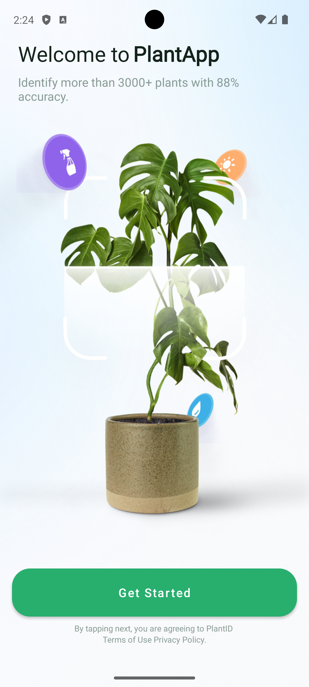
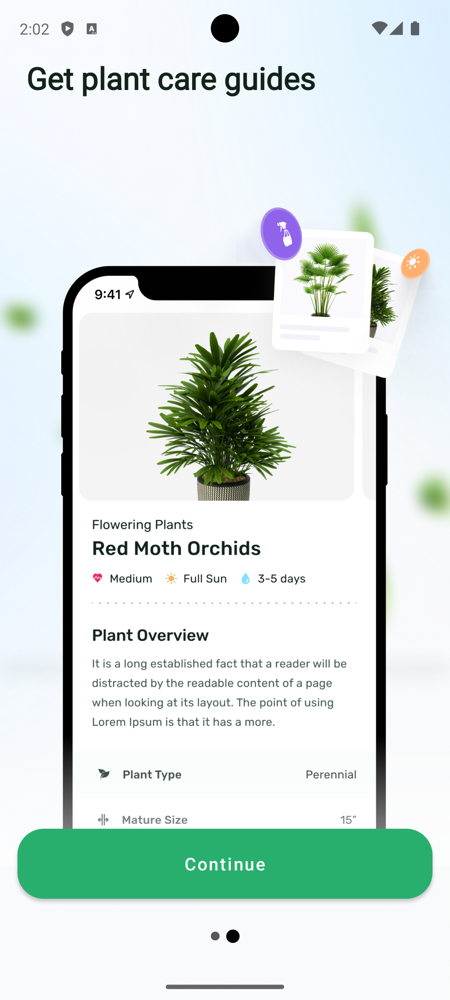
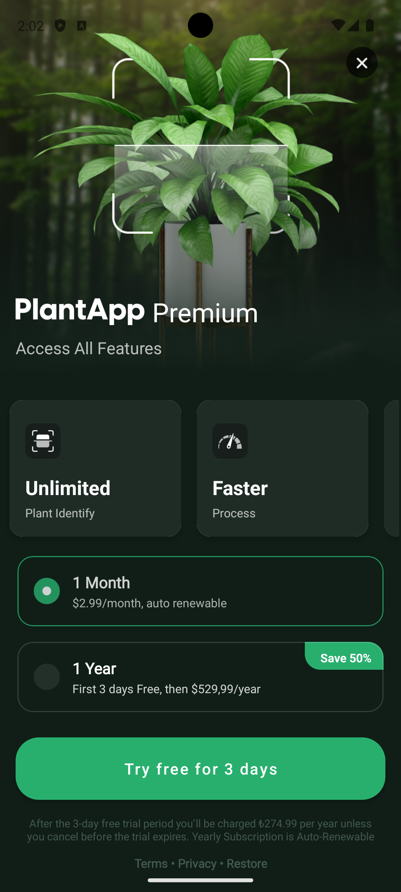
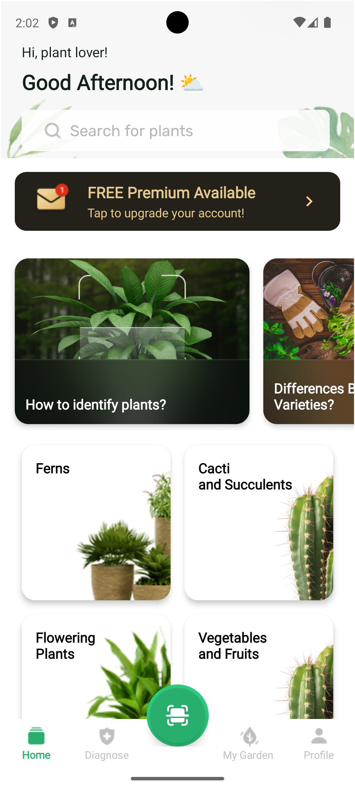

# Plant Application

Plant Mobile Application

## Contents

- [Requirements]()
- [Software Language and Technology]()
- [Structure]()
    - [Folder Structure]()
- [Libraries]()
- [API Calls]()
- [UI]()

## Requirements

- Gradle Version: 8.9
- AGP Version: 8.7.3
- targetSdk = 34
- minSdk = 24
- compileSdk = 35

## Software Language and Technology

- It is developed in Kotlin language.

## UI

<p align="center">
  
  
  
  
  
</p>

## API Calls

BASE_URL: "https://dummy-api-jtg6bessta-ey.a.run.app/"

#### Get Category Lists

```
  GET /getCategories"
```

#### Get Question Lists

```
  GET /getQuestions"
```

## Structure

Folder Structure

```bash  
.
└── PlantApp/
    ├── app/
    │   └── src/
    │       ├── main/
    │       │   ├── AndroidManifest
    │       │   ├── res
    │       │   │      ├── anim
    │       │   │      ├── drawable 
    │       │   │      ├── font
    │       │   │      ├── menu
    │       │   │      └── navigation
    │       │   │                
    │       │   └── java/
    │       │       └── com/
    │       │           └── kardelencetin/
    │       │                       └── plantapp/
    │       │                               ├── core/
    │       │                               │    ├── preferences
    │       │                               │    └── util
    │       │                               └── feature/
    │       │                                     ├── getstarted
    │       │                                     │         ├── model
    │       │                                     │         ├── module 
    │       │                                     │         ├── repository
    │       │                                     │         ├── usecase
    │       │                                     │         ├── view/fragment
    │       │                                     │         └── viewmodel
    │       │                                     ├── homepage
    │       │                                     │        ├── adapter
    │       │                                     │        ├── model
    │       │                                     │        ├── module 
    │       │                                     │        ├── repository
    │       │                                     │        ├── roomdb
    │       │                                     │        │        ├── dao
    │       │                                     │        │        ├── database
    │       │                                     │        │        └── entity
    │       │                                     │        ├── service
    │       │                                     │        ├── usecase
    │       │                                     │        ├── util
    │       │                                     │        ├── view
    │       │                                     │        │      ├── activity
    │       │                                     │        │      └── fragment
    │       │                                     │        └── viewmodel
    │       │                                     ├── main                                
    │       │                                     │      └── view/activity                                                    
    │       │                                     ├── onboarding
    │       │                                     │        ├── adapter
    │       │                                     │        ├── model
    │       │                                     │        ├── module 
    │       │                                     │        ├── repository
    │       │                                     │        ├── usecase
    │       │                                     │        ├── view
    │       │                                     │        │      └── fragment
    │       │                                     │        └── viewmodel
    │       │                                     └── paywall
    │       │                                               ├── adapter
    │       │                                               ├── model
    │       │                                               ├── module 
    │       │                                               ├── repository
    │       │                                               ├── usecase
    │       │                                               ├── view
    │       │                                               │      └── fragment
    │       │                                               └── viewmodel
    │       │
    │       │
    │       │
    │       │── test [unitTest]/
    │       │       └── java/
    │       │             └── com.kardelencetin.plantapp.feature.homepage           
    │       │                                                           └──viewmodel                                
    │       │                      
    │       │        
    │       └── build.gradle
    ├── build.gradle
    └── settings.gradle

```

## Libraries

The libraries used in the project are as follows.

```bash
-- AndroidX
- androidx.core:core-ktx
- androidx.appcompat
- androidx.constraintlayout
- androidx.activity
- androidx.navigation.fragment.ktx
- androidx.navigation.ui.ktx
- androidx.room:room-runtime
- androidx.room:room-ktx
- androidx.lifecycle:lifecycle-viewmodel-ktx
- androidx.lifecycle:lifecycle-livedata-ktx
- androidx.lifecycle:lifecycle-common-java8:
- androidx.core:core-testing
- androidx.test.ext:junit
- androidx.test.espresso:espresso-core

-- UI
- com.google.android.material:material
- com.github.bumptech.glide:glide
- com.squareup.picasso:picasso

-- Network
- com.squareup.retrofit2:retrofit
- com.squareup.retrofit2:converter-gson

-- Dependency Injection
- com.google.dagger:hilt-android
- com.google.dagger:hilt-android-compiler

-- Coroutines
- org.jetbrains.kotlinx:kotlinx-coroutines-core
- org.jetbrains.kotlinx:kotlinx-coroutines-android

-- Unit Test and Mocking
- junit:junit
- org.mockito:mockito-core:
- org.mockito.kotlin:mockito-kotlin
- io.mockk:mockk
- org.jetbrains.kotlinx:kotlinx-coroutines-test
- org.robolectric:robolectric

```

README.md dosyası [readme.so](https://readme.so/) kullanılarak oluşturulmuştur.


